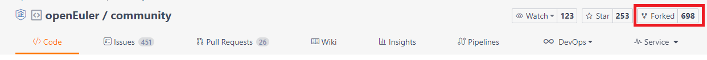
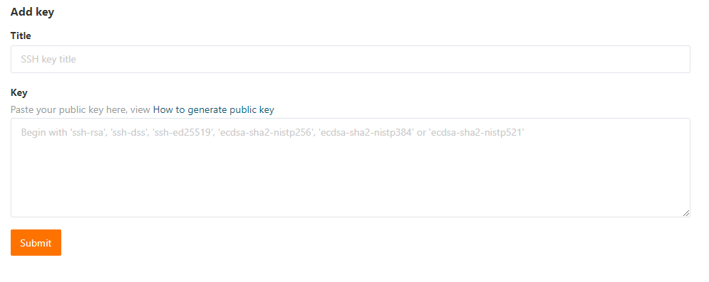
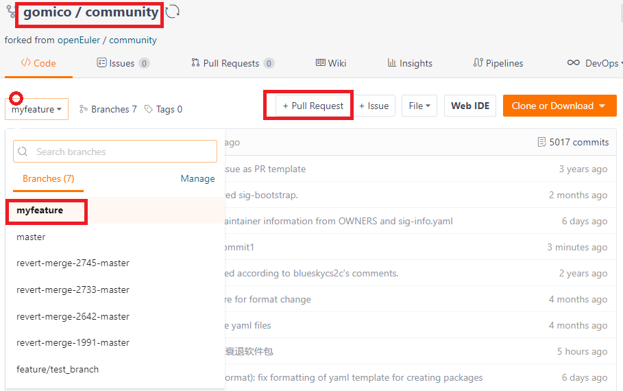
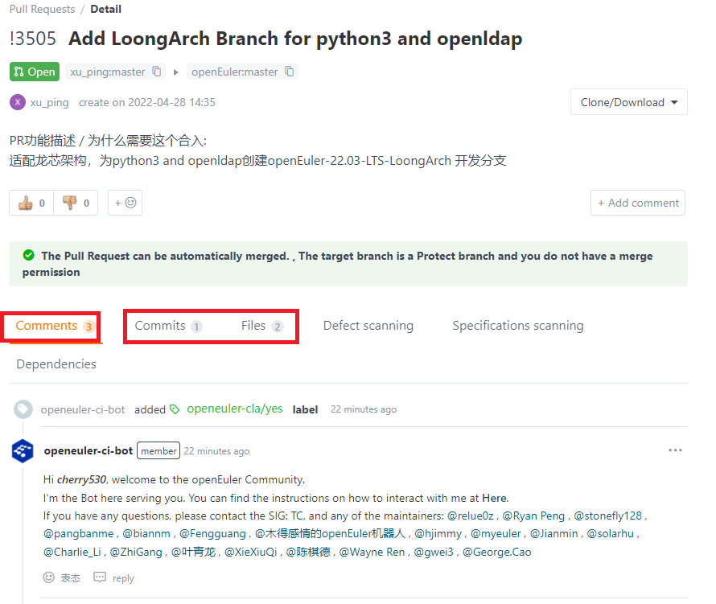
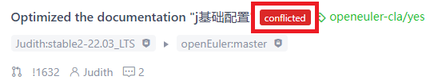

# Gitee Workflow

### 1. Preparations Before the Workflow

- Ensure that Git has been installed. You can search for more information about Git on Google, Baidu, or other search engines.
- Find a repository of your interest on the code hosting platform of the openEuler community. If you cannot find a repository you are interested in, see [Finding the Work of Your Interest](README.md/#finding-the-work-of-your-interest).


### 2. Forking a Remote Repository

1. Find and open the home page of the corresponding repository.
2. Click the **Fork** button in the upper right corner and follow the instructions to create a remote fork of **your own**.


### 3. Downloading the Forked Repository

Perform the following steps to download the code in the repository:

1. Create a local working directory.

Create a local working directory to facilitate local code search and management.

```
mkdir /YOUR_PATH/src/gitee.com/${your_working_dir}
```

> Note: If you have contributed to openEuler repositories, the created working directory will become a subdirectory of your existing **gitee.com** directory.


2. Configure the global user name and email for Git. (Skip this step if you have completed the configuration.)

Set the Git user name to your Gitee ID.

```
git config --global user.name "your Gitee ID"
```

Configure the Git email.

```
git config --global user.mail "email@your_Gitee_email"
```


3. Register an SSH public key. (If you do not complete the registration, your Gitee account and password will be required each time.)

- 1. Generate an SSH public key.

  ```
  ssh-keygen -t rsa -C "email@your_Gitee_email"
  cat ~/.ssh/id_rsa.pub
  ```

- 2. Log in to your Gitee account and add your SSH public key.

  On the Gitee page, click your avatar in the upper right corner and choose **Settings** below your avatar to open the personal settings. Under **Security Settings**, click **SSH Keys**. In the **Add Key** area, add the SSH public key obtained by running the `cat` command.

  

  Authenticate your local SSH client with Gitee.

  ```
  ssh -T git@gitee.com
  ```

  If the following information is displayed, the SSH public key has taken effect: 
  `Hi $user_name! You've successfully authenticated, but GITEE.COM does not provide shell access.`
  

4. Download the forked repository.

- 1. Switch to your local working directory.

  ```
  mkdir -p $working_dir
  cd $working_dir
  ```

- 2. Clone the forked repository.

  - The openEuler community consists of multiple organizations. Check the name of the organization that the remote repository belongs to before cloning.

  - Copy the address of the remote repository as **$remote_link** for cloning the repository:

    

  - Run the following commands to clone the repository:

    ```
    # Clone the forked repository
    git clone https://gitee.com/$user_name/$repository_name

    # Add the upstream remote (upstream repository of your forked repository) to the local working directory.
    git remote add upstream https://gitee.com/openeuler/$repository_name

    # Set the synchronization mode.
    git remote set-url --push upstream no_push
    ```


### 4. Creating a Branch

Update your local repository.

```
git fetch upstream
git checkout master
git rebase upstream/master
```

Create a branch.

```
git checkout -b myfeature
```

Edit and modify the code on the **myfeature** branch.


### 5. Local Build and Verification

For details about how to build locally, see the related documents provided in the repository. For details about how to obtain the documents, see [this section](README.md/#understand-the-sig-and-development-precautions-in-the-project).


### 6. Keeping Your Branch Up to Date with Upstream

```
# While on your myfeature branch
git fetch upstream
git rebase upstream/master
```

When merging branches, do not use `git pull` to replace the `fetch` and `rebase` commands above. This is because it makes the commit history confusing and code difficult to understand. You can also modify the **.git/config** file to change the default behavior of `git pull` by running the `git config branch.autoSetupRebase always` command.


### 7. Committing Changes in the Local Working Directory

Commit your changes.

```
git add .
git commit -m "Reason for the commit"
```

You may continue to edit the build and perform more tests based on the previous commit and run the `commit --amend` command to add more content to it.


### 8. Pushing Changes to Your Remote Repository

When your changes are ready to be reviewed (or you want to establish a remote backup of your work), push the branch to your forked repository on Gitee.

```
git push -f origin myfeature
```


### 9. Creating a Pull Request on Gitee

1. Visit your **https://gitee.com/$user/$repository** page.

2. Select the branch you used when committing your changes, for example, **myfeature**, and click **+ Pull Request**, as shown in the following figure.

   

3. On the **Create Pull Request** page, confirm the source branch and target branch, and click **Create Pull Request**.

4. A pull request (PR) merges changes into the main project repository. To ensure the quality of the changes to be merged, exercise caution when creating a PR. For details about how to create a PR, see [Pull Request Submission Guide](pull-request.md). In this way, the PR you created can be correctly and quickly responded to and merged.

*If you have write access to the upstream repository*, do not use the Gitee UI to create a PR because Gitee will create a branch of your PR in the upstream repository.


### 10. Viewing and Responding to Code Review Comments

#### Viewing Code Review Comments

After you create a PR, the PR is assigned to one or more reviewers. The reviewers will conduct thorough code reviews to ensure the correctness of the committed changes, including the code, comments, and documents.

You can find your PR in the PR list and view the review comments on the PR.



**Small PRs are easy to review. Large PRs may not be correctly reviewed.**


### Reverting a Commit

To revert a commit, follow the steps below.

*If you have write access to the upstream repository*, do not use the Gitee UI to create a PR because Gitee will create a branch of your PR in the upstream repository.

- Create a branch and synchronize it with the upstream repository.

  ```
  # create a branch
  git checkout -b myrevert
  
  # sync the branch with upstream
  git fetch upstream
  git rebase upstream/master
  ```

- Run either of the following commands according to the type of the commit you want to revert.

  - For a **merge commit**:

    ```
    # SHA is the hash of the merge commit you wish to revert
    git revert -m 1 SHA
    ```

  - For a **single commit**:

    ```
    # SHA is the hash of the single commit you wish to revert
    git revert SHA
    ```

- A new commit is created to revert the previous commit. Then, run the `push` command to push the commit to your remote repository.

```
git push ${your_remote_name} myrevert
```

- Create a PR based on the created branch.


### Resolving PR Conflicts

The following mark indicates that your PR conflicts with the main repository. You need to resolve the conflict.



1. Switch to the **master** branch and rebase it onto the upstream **master** branch.

```
git checkout master
git fetch upstream
git rebase upstream/master
```

2. Switch to the branch you are using and start rebasing.

```
git checkout yourbranch
git rebase master
```

3. The conflict message is displayed in the Git output. You can use tools such as `vi` to view the conflict.

4. After the conflict is resolved, commit the changes.

```
git add .
git rebase --continue
git push -f origin yourbranch
```


# Squashing Commits

Multiple commits in a PR can cause inconvenience to reviewers. After you modified the code in a PR based on the PR review comments, you can squash the commits If you do not want the reviewers to see multiple commits.  

1. View commit logs of the local branch.

```
git log
```

2. Squash the latest *n* commits into one.

```
git rebase -i HEAD~n
```

Change **pick** before the commits to be squashed to **s**, which is the first letter of **squash**. Note that you must **pick** at least one commit. Otherwise, there is no commit to be rebased onto, causing an error.

3. After the modification is complete, press **Esc** and enter **:wq**. The page for squashing the commit messages is displayed. Delete or edit the commit messages as required. Then, press **Esc** and enter **:wq** to save the modification and exit.

4. Push the commit.

```
git push -f origin yourbranch
```

5. Go back to the PR page on Gitee. You can see that the previous commits have been squashed.
