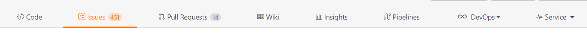
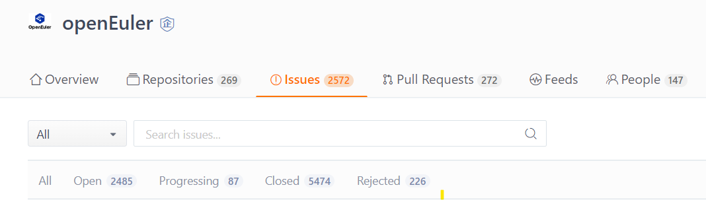
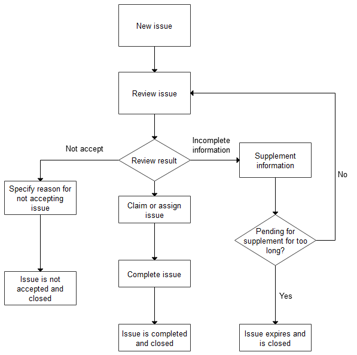
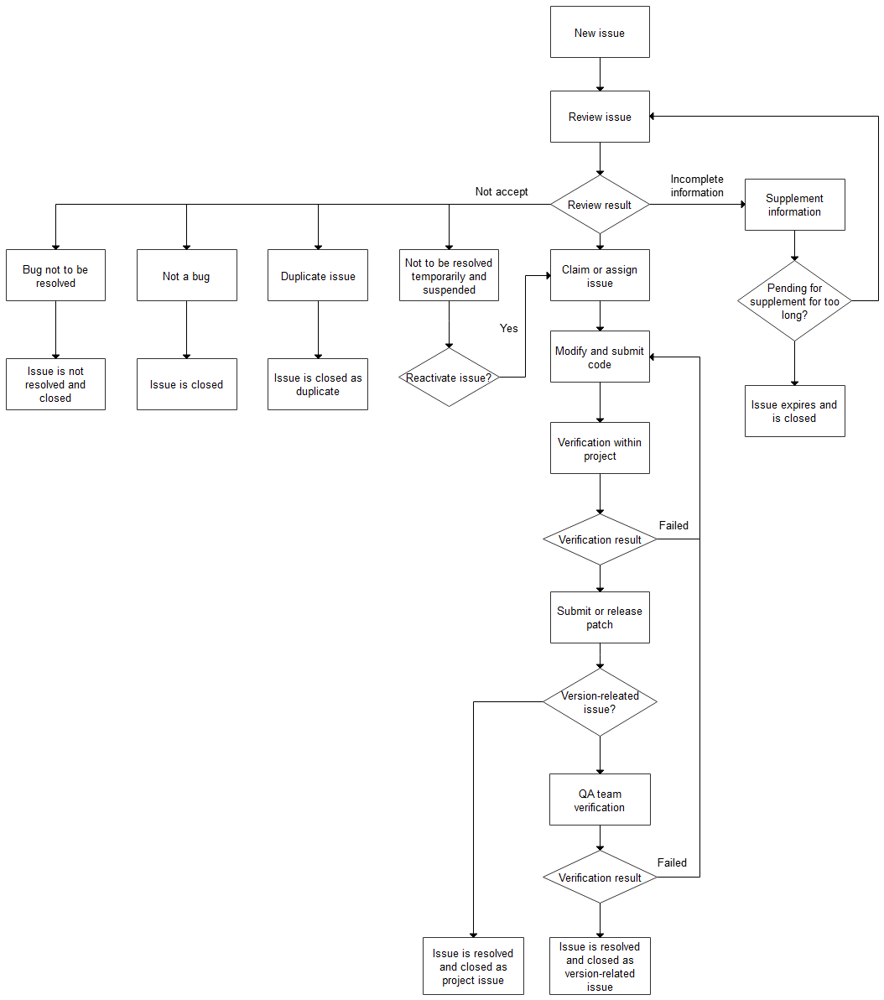

# Issue Submission and Handling Guide

Contents:

- [Issue Introduction](#issue-introduction)
- [Basic Issue Functions](#basic-issue-functions)
- [Issue Overview](#issue-overview)
- [Requirement Issue Submission and Handling Guide](#requirement-issue-submission-and-handling-guide)
- [Bug Issue Submission and Handling Guide](#bug-issue-submission-and-handling-guide)
- [Security Issue Submission and Handling Guide](#security-issue-submission-and-handling-guide)


##  Issue Introduction

- **Definition**: An issue refers to a task to be completed. Such task can be a "problem", "transaction", "requirement", or "suggestion". Each issue should contain all the information and history of the task, so that other viewers can understand all the aspects and processes of the task.

- **Source and function**: The concept of issue originates from the customer service department. When a user makes a call to report a problem, the customer service personnel create a ticket. Each subsequent processing step and each communication with the user need to be updated to the ticket to record all process information. This is the predecessor of the issue. As it expands, the issue evolves into a full-function project management tool for developing and executing software development plans.

- The openEuler community uses the issue tracking and management system provided by Gitee.


## Basic Issue Functions

- Each repository of Gitee has an **Issues** page.



- On the page that is displayed, click **+New Issue** to create an issue, as shown in the following figure.


- Enter the title and content of the issue on the left and configure optional configuration items on the right. The following describes these configuration items.
  - **Assignees**: Select the handler of the issue from all members of the current repository, including the owner and collaborator.
  - **Labels**: Add a label to the issue to facilitate issue management and filtering.
  - **Projects**: Associate the issue with a project. Only SIG members have the permission to associate projects.
  - **Milestones**: Associate related issues with one milestone. Milestones can usually be understood as different versions or iterations.
  - **Branches**: Specify the branch to which the issue belongs.
  - **Planed to start**/**Planed to end**: Specify the planned start/end date for the issue for the reference of the person who claims the issue.
  - **Top level**: Choose whether to place the issue on the top of the issue list to attract attention.
  - **Priority**: Specify the priority of the issue.


## Issue Overview

Only the current repository can be viewed and operated on the Issue panel. Gitee also provides the global view of issues.

- Global view of the organization: Click the **Issues** panel of the openEuler organization to view all issues of the organization.

  

- Individual global view: Click any issue in the organization global view. The individual workspace page is displayed. Click Task on the left to view and operate all issues related to you. You can select either of the two display modes. You can also filter, filter, and sort data based on different conditions on the toolbar.

  
  
  


## Requirement Issue Submission and Handling Guide

For details about the complete requirement issue handling process, see the following flowchart.



**Step 1. Create a requirement issue.** (Issue status: **Backlog**)

- Go to the repository of the team or project corresponding to the requirement. For details about how to find the repository, see [this section](README.md/#id2-1-2). On the **Issues** panel, click **+New Issue**.

- If you are not sure about the team or project corresponding to the requirement, create an issue in the [community repository](https://gitee.com/openeuler/community-issue). The community developers will help you find the team or project.

- Select **Requirement** in the issue type drop-down list next to the title box. The requirement issue template is displayed.

- **Briefly describe the key points of the requirement** in the title.

- Describe the scenario and value of the requirement in the description.

*Note: Clear and complete description helps group members understand and accept the requirement, and schedule the development plan more quickly.*

**Step 2. Team members review the issue.** (Issue statuses: **Doing** - accepted, **Backlog** - additional information needed, **Declined** - rejected)

- **Step 2.1**: Accept after review

  If a reviewer (maintainer or committer) thinks that the requirement can be accepted, the reviewer needs to supplement information about the accepted requirement, including:

  - Check and set the project to which the requirement belongs.
  - Set the recommended milestone (planned version) to incorporate the requirement.
  - Set the priority label of the requirement by choosing **feature:High**, **feature:Medium**, or **feature:Low** in the label column.
  - After the preceding information is added, change the status of the issue to **Doing** (and proceed to **Step 3**).

- **Step 2.2**: Suspend due to unclear description

  If team members think that the issue description is not clear, they can leave a message in the comment area or discuss the issue in the mailing list, and ask the submitter to supplement related information.
  
  - **Step 2.2.1**: If the submitter does not supplement related information within one month, the issue is automatically closed. (Go to **Step 4**)
  - **Step 2.2.2**: After supplementing information, the issue submitter can leave a message in the comment area to remind the team members to review the issue. (Go to **Step 2**)
  
- **Step 2.3**: Reject after review
  
  If a team member rejects a requirement because it is of low value or for other reasons, the team member can leave a message in the comment area or discuss the reasons in the mailing list. After confirming the rejection, change the status of the issue to **Declined**. (Go to **Step 4**)

**Step 3. Claim or assign an issue.** (Issue status: **Open**)

Requirements in the development phase can be claimed proactively or assigned by team members. You can enter **/assign** in the comment area to assign the issue to yourself or others.

**Step 4. Close the issue.** An issue can be closed when:

- The requirement is completed. The claimer can manually change the issue status or associate a PR so that the issue is automatically closed after the PR is merged.
- The requirement is rejected. The reviewer manually changes the status.
- The requirement expires. The issue is automatically closed based on the suspension time.


## Bug Issue Submission and Handling Guide

Discovering and submitting issues is one of the good ways to contribute to the community. This section describes how to write a well-crafted issue.



**Step 1. Create a bug issue.**

- Go to the repository of the team or project corresponding to the bug. For details about how to find the repository, see [this section](README.md/#id2-1-2). On the **Issues** panel, click **+New Issue**.
- If you are not sure about the team or project corresponding to the bug, create an issue in the [community repository](https://gitee.com/openeuler/community-issue). The community developers will help you find the team or project.
- Select **Bug** in the issue type drop-down list next to the title box. The bug issue template is displayed.
- **Briefly describe the key points of the bug** in the title.
- Describe the bug in the description based on the bug issue template shown below.  
  *Note: Clear and complete description helps group members understand and accept the requirement, and schedule the development plan more quickly.*

```
[Environment]
Hardware Information
- Provide information about the hardware in the bare device scenario.
- Provide the XML file or configuration information of the VM in the VM scenario.
Software Information
- OS version and branch
- Kernel
- Version of the bug component
Network Information
- Provide network topology information in special networking.

[Bug Reproduction Procedure]: Describe the detailed operation procedure.
[Actual Result]: Describe the result and impact of the bug.
[Attachments]
System message logs, component logs, dump information, and images.
```

**Step 2: Review the bug.**

- **Step 2.1**: Confirm that the bug needs to be addressed. (Go to **Step 3**)
- **Step 2.2**: If team members think that the issue description is not clear, they can leave a message in the comment area or discuss the issue in the mailing list, and ask the submitter to supplement related information.
  - **Step 2.2.1**: If the submitter does not supplement related information within one month, the issue is automatically closed. (Go to **Step 8.3**)
  - **Step 2.2.2**: After supplementing information, the issue submitter can leave a message in the comment area to remind the team members to review the issue. (Go to **Step 2**)
- **Step 2.3**: Suspend a bug issue due to specific reasons. (Go to **Step 8.7**)  
The reasons include:
  - 1. This issue is a bug that will be fixed in the next supported version, but is not planned to be fixed in the version that this bug is submitted to. In this case, you are advised to copy the issue to the next version.
  - 2. The maintainer expects the bug to be fixed by an update released by the upstream community. In this case, add comments and attach the error report link of the upstream community.
- **Step 2.4**: If the issue is a duplicate, attach the link to the original issue. (Go to **Step 8.4**)
- **Step 2.5**: If the issue is not a bug, describe the reason. (Go to **Step 8.6**)  
The reasons include:
  - 1. The symptom is normal.
  - 2. The version where the bug occurs is no longer maintained, and the bug does not occur in later versions.
- **Step 2.6**: Confirm that an issue is a bug but the bug will not be fixed. (Go to **Step 8.5**)  
The reasons include:
  - 1. The cost of fixing the bug is high but the impact is small. Therefore, the bug will not be fixed.
  - 2. The bug is caused by third-party software.

**Step 3: Claim or assign an issue.** Issues can be claimed proactively or assigned by team members. You can enter **/assign** in the comment area to assign the issue to yourself or others.

**Step 4: Modify the code and submit a PR.** After modifying and locally verifying the code, attach the link to the issue when submitting a PR. For details, see [Associate a Commit to an Issue](https://gitee.com/help/articles/4141) in the Gitee help document. For details about how to submit a PR, see the [Pull Request Submission Guide](pull-request.md).

**Step 5: Verify the modification in the project.** Verify the PR within the project. If the verification fails, go back to **Step 4**. If the verification is passed and the issue is not related to the openEuler version, close the issue as a project team issue.

**Step 6: Submit or release a patch.** The maintainer of the project team determines the way to address the issue, including updating the software package and releasing a patch. If the issue is a key issue related to the openEuler version, it is then verified by the QA team.

**Step 7: Wait for the QA team to verify the issue at the version level.** After the verification is successful, proceed to **Step 8**.

**Step 8: Close the issue.** Specify the reason for closing the issue in the description. The reasons include:

- 1. The issue within the project is resolved.
- 2. The issue related to a version is resolved.
- 3. The issue information is pending for supplement for a long time.
- 4. The issue is a duplicate.
- 5. The issue is not to be resolved.
- 6. The issue is not a bug.
- 7. The issue is not to be resolved temporarily and is suspended.


### Submit an Issue and Assist in Issue Handling

If the description and reproduction procedure you submitted with the issue are clear and the bug can be located, a participant will directly locate and fix the bug. However, the developer who is responsible for tracking this issue may need more information from you. Your cooperation will be appreciated.


## Security Issue Submission and Handling Guide

For details about how to handle security issues, see [this document](https://www.openeuler.org/en/security/vulnerability-reporting/).
