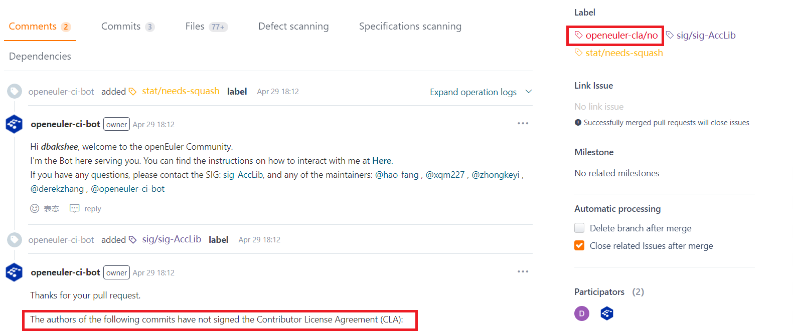
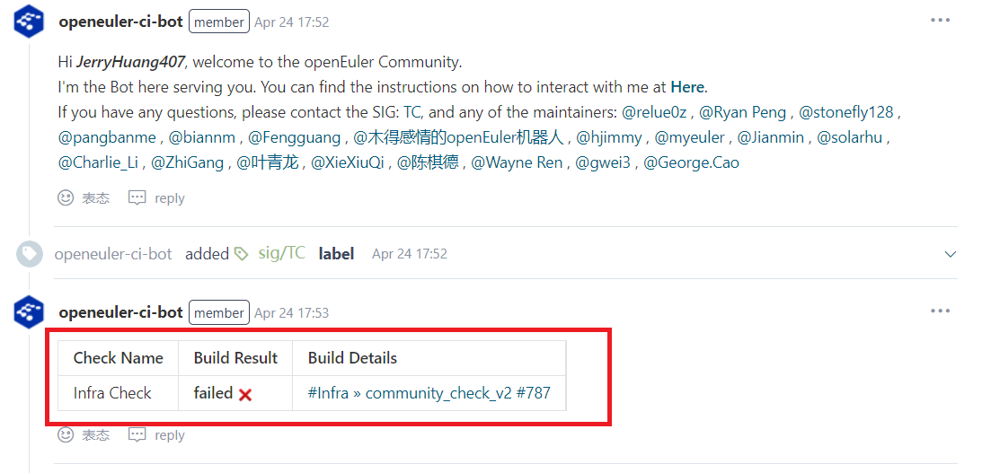

# Pull Request Submission Guide

This guide helps you ensure that your pull request (PRs) comply with our best practices.

## Before Submitting a PR

A PR merges changes into the main project repository. To ensure the quality of the changes to be merged, exercise caution when creating a PR. Before submitting a PR, verify the changes locally to ensure that the PR passes the continuous integration test. Local verification methods vary with projects. For details, see [this section](README.md/#participate-in-coding).

## Submitting PRs

### 1. Submit a PR

For details about how to submit a PR on Gitee, see [Gitee Workflow](Gitee-workflow.md). To get a quick response, you can add a label to the PR or provide more information. Pay attention to the following:

- **Associate an issue**: If the PR is submitted to address a specific issue, add a number sign (#) in the description area. The existing issues will be displayed so that you can quickly associate an issue. For details, see [this document](https://gitee.com/help/articles/4142).
- **Set the priority**: You can set the priority when creating a PR. Alternatively, enter **/priority high** in the comment area to add a high-priority label to the PR.
- **Mark the PR submitted for bug fixing**: You can enter **/kind bug** in the description area box to mark that the PR is for fixing a bug so that you can get a quick response for the PR.
- **Identify the SIG to which the PR belongs**: You can enter **sig _sig-name_** in the description area to identify the SIG to which the PR belongs for easy search.

### 2. Assign a Reviewer

After you submit a PR, the community bot will automatically assign a reviewer to the PR. You can also specify a reviewer by selecting a reviewer from the drop-down list on the right when creating a PR or entering **/assign @reviewer** in the comment area to assign the PR. If you want to submit the PR to the core members of the project team for review so that the PR can be approved quickly, you can obtain the information about the core members in either of the following ways:

- 1. Check the **owners** file (usually in the root directory of the repository) which stores the list of all reviewers of the repository.
- 2. See the **README.md** file on the home page of the SIG to which the project belongs. The file lists the SIG owner, all projects of the SIG, and project owners.

## Automated Testing

- If the **openeuler-cla/no** label is added to the PR, you have not signed the Contributor License Agreement (CLA) with the community. Sign the CLA as prompted by the community bot.

  

- After the PR is submitted, the community bot starts the automated testing. To save time of reviewers, only the PRs that pass the testing are reviewed. You can view the automated testing results in the comment area of the PR.

- If the automated testing fails, you can view the failure cause in **Build Details**.

Click **Build Details** to open detailed log information, where you can search for **Error** to quickly locate error information.

- After modifying the code, you can enter the **/retest** command in the comment area to request the community bot to initiate automated testing again.

## Reviewing PRs

- If your PR is approved, the reviewer will add **/lgtm** or **/approve** in the comment area.

- The reviewer may leave comments in the comment area or add comments to the file where problems are found during code review. Either way, the comments will be displayed in the comment area. The difference is that **Code comment** is displayed for the latter comment. You can click **View Detail** to view the source of the comment.

- Be respectful of different viewpoints. Reply to the comments and give your opinion on different viewpoints. If you accept the reviewer's opinion, give a simple reply and confirm whether the code has been modified based on the accepted comments.

- You can also click **Files** to view the code review comments and comparison results in the file area, and directly reply to the review comments here.

  

- If core members of the project team reject your PR, they will give comments. Do not be discouraged. Make adjustments based on the suggestions and keep in touch with the project team members. Your capabilities and opinions will be respected.

- Note that at least one **/lgtm** label is required before **/approve** is used.

## Marking Uncompleted PRs

If you want to ask for opinions before the PR is completed, you can:

1. Add a **hold** or **hold-cancel** label in the comment area.

2. Add a **WIP** or **[WIP]** prefix to the title of the PR.

PRs with any of these labels will not be merged.

## PRs and the Release Cycle

If your PR is approved but not merged, the possible cause is that the current version is in a specific period of the release cycle. When a version is dedicated to solving a specific problem or achieving a specific objective, the repository may be frozen to block merging. If you think this status is inappropriate, contact the corresponding SIG, project owner, or [sig-release-management](../../sig/sig-release-management/) for clarification.

### Label **test-ready**

SIG members can apply the **test-ready** label to a PR submitted by a contributor to indicate that the PR is ready for testing.

## Command Reference

openeuler-ci-bot applies structured labels to PRs. The bot can provide some useful advice during your PR process. For details, see [Community Command Reference](../sig-infrastructure/command.md).
