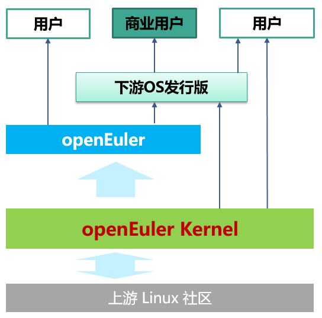
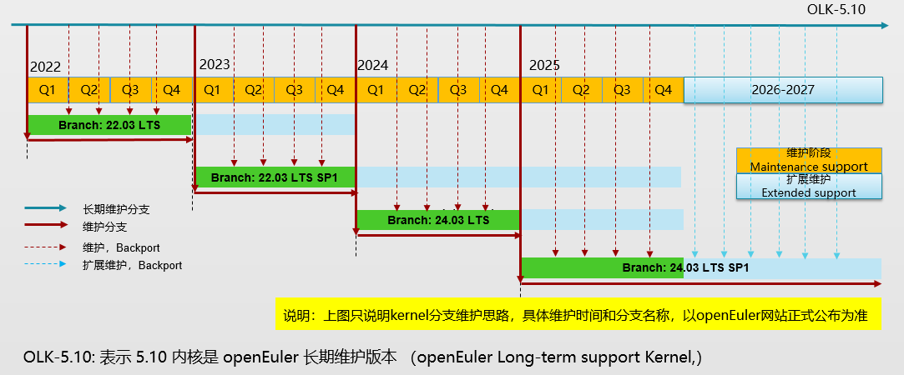

## openEuler kernel介绍

openEuler kernel 是 openEuler 社区维护的 Linux 内核，其源于上游 [Linux Kernel 社区](http://www.kernel.org)，并在此基础上，合入众多新特性、新硬件架构支持、性能优化、可靠性增强等补丁，希望在社区的共同努力下，功能更丰富、质量更稳定、更安全、更可靠，为 openEuler 以及下游OS发行版提供安全、稳定、可靠的内核基座。让openEuler 以及下游OS发行版能更聚焦业务，简化OS版本的构建和维护，减少在内核上的重复投入。



### openEuler kernel宗旨

* 源于社区，贡献社区
* 开放、多元和架构包容
* 社区化开发和维护

## 版本管理

openEuler 发行版分为创新版本和稳定版本（也说长期维护版本，或简称 LTS)。相应的openEuler内核也分为创新版本和稳定版本。

* 创新版本：提供新技术验证的平台，加速技术成熟和应用。
* 稳定版本：成熟、稳定、可靠，为众多OS发行版提供底座

|          | **创新版本**               | **稳定版本（LTS）**                  |
| -------- | -------------------------------- | ------------------------------------------ |
| 目的     | 新技术验证；为稳定版本做技术储备 | 质量与稳定优先                             |
| 版本选型 | 上游较新的  LTS 版本             | 稳定版本维护时间较长，可能版本比较老       |
| 维护周期 | 较短，一般不超过1年              | 较长，社区目前暂定4年                      |
| 维护内容 | 严重的安全漏洞和Bugfix           | 优化、增强、硬件支持、安全漏洞、Bugfix  等 |
| 质量目标 | 功能可用, 不要用于生产环境       | 兼顾安全、稳定、可靠                       |
| 维护补丁 | 较少                             | 较多                                       |
| KABI     | 不维护                           | 维护白名单                                 |

### 关于长期维护版本（openEuler Long-term support Kernel）

在openEuler社区中，每隔几年， kernel sig 会选取一个上游社区的 LTS 内核作为openEuler社区长期维护的内核版本，至少维护4年（具体以openEuler社区正式公布为准）。openEuler 的LTS发行版所使用的内核都会基于openEuler kernel 的长期维护版本（简称 OLK), openEuler Longterm support Kernel)，部分创新版本也会使用 OLK。

当前 openEuler Long-term support Kernel 版本是 4.19，该版本至少维护到2024年3月份。下一个 OLK 版本预计是 5.10，预计openEuler 21.03、21.09、22.09 三个创新版本和openEuler 22.03 LTS 都会使用该版本。

（该章节所说的版本周期或日程用于描述openEuler kernel 的生命周期思路，具体以[openeuler.org正式发布](https://www.openeuler.org/zh/other/lifecycle/)为准）

除了上述所说的长期维护版本，openEuler 社区还会有一些短周期的维护版本，这些版本主要用于新技术验证或体验，比如当前的 5.5, 是短期维护版本，用来支持 risc-v 的开发和验证，后续会升级到 5.10，之后 5.5 便不再维护。未来可能会有部分openEuler的创新版本使用短期维护版本，用来体验或验证新技术。

### 哪些补丁可以合入 openEuler Longterm Support kernel

* 问题修复或安全漏洞修复
* 性能优化的特性
* 主线回合的 Bugfix、优化或有用的特性
* 可靠性、安全性、可维护性增强的补丁、特性
* 新架构支持或增强
* 新设备

### 开发者可以做哪些事情

- 使用和测试 openEuler kernel，包括

  - 搭建测试环境，在多种设备上进行测试
  - 预发布版本的测试
  - 专项测试等
- 解决社区 issue 以及解答相关疑问和问题
- 完善 kernel 相关文档
- 承担某个模块、子系统、或驱动的维护，最简单的方法是提交PR/发补丁，请参见[贡献openEuler kernel社区]()

## 分支管理

- 长期维护分支(OLK: openEuler Long-term support Kernel)：持续维护分支，及时合入社区 stable 补丁，回合高版本特性，为 openEuler 发行版提供内核候选版本。该分支作为 openEuler kernel 的主线，不维护 kabi 兼容性。
- openEuler 版本分支：选取某个OLK子版本，用于openEuler发行版，维护周期与对应的openEuler版本相同，发布之后以安全稳定为主，补丁合入须有明确的需求，以合入CVE和Bugfix为主。
- openEuler LTS 的SP版本：年度SP版本，一般选最近的OLK版本子版本，该版本一般包含最近的社区更新，包含较新的特性和优化。

| 分支                                    | 维护人                                                     | 发布时间 | EOM 时间                      | 状态     |
| --------------------------------------- | ---------------------------------------------------------- | -------- | ----------------------------- | -------- |
| openEuler-1.0-LTS `<sup>`1 `</sup>` | 章昌仲[@zhang-changzhong](https://gitee.com/zhang-changzhong) | 2020-03  | 2026-03 `<sup>`2 `</sup>` | 维护中   |
| openEuler-20.09                         | 无                                                         | 2020-09  | 2021-03                       | 停止维护 |
| kernel-5.5 `<sup>`3 `</sup>`        | 无                                                         | 2020-09  | 2021-03                       | 停止维护 |
| openEuler-20.03-LTS-SP3                 | 章昌仲[@zhang-changzhong](https://gitee.com/zhang-changzhong) | 2021-12  |                               | 维护中   |
| OLK-5.10                                | 张伽琳[@zhangjialin11](https://gitee.com/zhangjialin11)       | 2021-03  | 2028-03                       | 维护中   |
| openEuler-22.03-LTS                     | 张伽琳[@zhangjialin11](https://gitee.com/zhangjialin11)       | 2022-03  | 2024-03                       | 维护中   |

```
Notes:
  1 由于历史原因 kernel 的分支名与 openEuler 发行版本命名不一致。但为保持源码仓库的持久一致性，这里不做修改，仅做说明。
  2 LTS 版本的维护时间包含了SP版本的维护时间。
  3 仅用于支持openEuler 20.09 RISC-V 版本，受限使用，请不要用于生产环境。
```

### 补丁同步策略

所有合入openEuler LTS 发行版的特性、新开发、以及bugfix的补丁，都首先合入长期维护分支，然后根据需要，合入对应的维护分支 （openEuler-* 等分支）



### 分支关系

```
Relationship of openEuler kernel 4.19 branches:

------------------------------------------------------------------> Linux 4.19.y
  |
  | tag: v4.19.13
  |
  -----------------------------------------------------------> openEuler-1.0-LTS

```

```
Relationship of openEuler kernel 5.10 branches:

------------------------------------------------------------------> Linux 5.10.y
  |
  | tag: v5.10
  |
  --------------------------------------------------------------------> OLK-5.10
    |     |     |     |     |
    | tag: 5.10.0-4.0.0     |
    |     |     |     |     |
    ------^-----^-----^-----^--------------> openEuler-21.03(Innovative version)
	  |     |     |     |
	  | tag: 5.10.0-5.0.0
	  |     |     |     |
	  ------^-----^-----^--------------> openEuler-21.09(Innovative version)
	        |     |     |
	        | tag: 5.10.0-60.0.0
                |     |     |
		------^-----^------------------------------> openEuler-22.03-LTS
                      |     |
		      | tag: 5.10.0-106.0.0
		      |     |
		      ------^--------------> openEuler-22.09(Innovative version)
		            |
			    | tag: 5.10.0-136.0.0
			    |
			    ---------------------------> openEuler-22.03-LTS-SP1

```

## 项目清单

| 名称       | 仓库地址                                                                        | 说明                                                                                            |
| ---------- | ------------------------------------------------------------------------------- | ----------------------------------------------------------------------------------------------- |
| 内核源码仓 | [https://gitee.com/openeuler/kernel](https://gitee.com/openeuler/kernel)           | 存放openEuler Kernel各分支源代码文件                                                            |
| 内核构建仓 | [https://gitee.com/src-openeuler/kernel](https://gitee.com/src-openeuler/kernel)   | 存放openEuler Kernel各分支spec等文件，被obs/ebs构建系统用于构建内核rpm包                        |
| 内核文档仓 | [https://gitee.com/openeuler/kernel-docs](https://gitee.com/openeuler/kernel-docs) | 用于存放openEuler Kernel相关的文档资料，包括但不限于指导文档，SIG例会材料，技术分享视频及文章等 |

## 项目及事务管理

### 管理平台

* openEuler kernel版本开发相关事务通过Gitee[企业版工作台](https://e.gitee.com/open_euler/dashboard)跟踪
* 各版本开发进展通过[里程碑](https://e.gitee.com/open_euler/milestones?ms%5Bproject_id%5D=7696525)管理跟踪，里程碑的命名规则为“版本名称-Kernel-阶段名称”，仓库必须关联'openeuler/kernel'

### 缺陷管理

* openEuler kernel的缺陷管理通过Gitee仓库的issue功能承载，例如内核相关issue提交至[openeuler/kernel](https://gitee.com/openeuler/kernel/issues)仓库
* 内核CVE漏洞一般由[openeuler-ci-bot](https://gitee.com/openeuler-ci-bot)抓取，并在[src-openeuler/kernel](https://gitee.com/src-openeuler/kernel/issues)仓库创建issue
* 治理细则请参见[缺陷类ISSUE处理规范]()及[内核漏洞处理规范](https://gitee.com/openeuler/community/blob/master/sig/Kernel/%E5%86%85%E6%A0%B8%E6%BC%8F%E6%B4%9E%E5%A4%84%E7%90%86%E8%A7%84%E8%8C%83.md)

### 需求管理

* openEuler kernel的需求管理通过Gitee仓库的issue功能承载，例如内核相关的需求issue提交至[openeuler/kernel](https://gitee.com/openeuler/kernel/issues)仓库
* 治理细则请参见[需求类ISSUE处理规范]()

## 组织会议

- SIG例会时间：北京时间，双周下午，14:00 - 15:30
- 会议通知：通过Kernel-discuss邮件列表发送，请在[https://mailweb.openeuler.org/postorius/lists/kernel-discuss@openeuler.org/](https://mailweb.openeuler.org/postorius/lists/kernel-discuss@openeuler.org)订阅

## 成员

### Maintainer列表

- 谢秀奇 [@xiexiuqi](https://gitee.com/xiexiuqi)
- 郑增凯 [@zhengzengkai](https://gitee.com/zhengzengkai)
- 杨颖梁 [@yangyingliang](https://gitee.com/yangyingliang)
- 成坚 [@gatieme](https://gitee.com/gatieme)

### Committer列表

请参见 [openEuler kernel Committer List](committers.md)

关于Maintainer与Committer的工作职责及任免，请参见[openEuler Kernel SIG运作章程]()

## 联系方式

- 邮件列表

  | 名称           | 邮件地址                                                             | 描述                                                    |
  | -------------- | ---------------------------------------------------------------- | ------------------------------------------------------- |
  | Kernel         | [kernel@openeuler.org](mailto:kernel@openeuler.org)                 | Kernel development mailing list                         |
  | Kernel-discuss | [kernel-discuss@openeuler.org](mailto:kernel-discuss@openeuler.org) | Tech discussing，kernel release note，meeting notice... |
