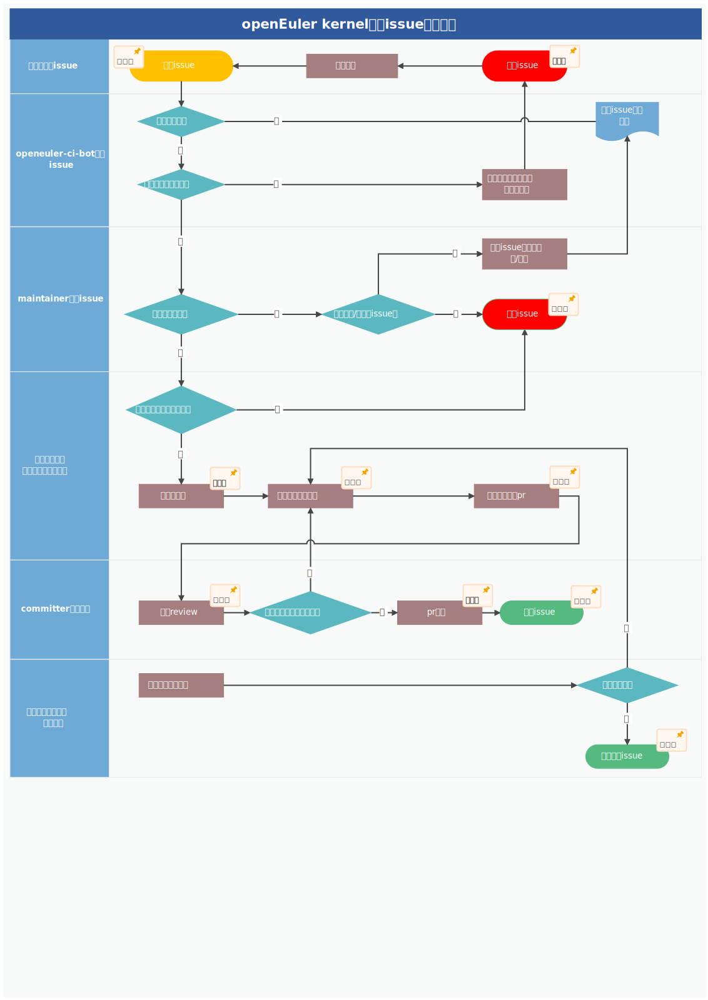

修订记录

| 日期      | 修订版本 | 修改章节 | 修改描述 | 作者                         |
| --------- | -------- | -------- | -------- | ---------------------------- |
| 2023.2.25 | 1.0      | 初稿撰写 |          | 张伽琳、郑增凯、谢秀奇、李炜 |

## 1. 缺陷issue处理流程

标准的缺陷issue处理流程主要包括以下6步：

1. 提单人提交issue
2. openeuler-ci-bot审核issue
3. maintainer审核issue
4. 开发人员处理
5. committer审核修改
6. 测试人员回归处理（可选）

详细流程图如下所示：

## 2. 提单要求

提单人需要根据openEuler社区缺陷issue模板，填写详细的硬件信息、软件信息、复现步骤、预期结果、实际结果等，否则openeuler-ci-bot审核不通过，会暂时挂起，并在issue里回复，指出缺少的信息。提单人修改描述之后，可以重新触发openeuler-ci-bot审核流程。

## 3. 缺陷issue状态

| 缺陷issue状态 | 描述                                                                   |
| ------------- | ---------------------------------------------------------------------- |
| 待办的        | 提单人新建issue的初始状态                                              |
| 已挂起        | 由于缺少关键信息、问题无法复现、当前里程碑无法解决等原因，决定暂不处理 |
| 已确认        | 经过openeuler-ci-bot审核、maintainer审核、开发人员确认，认为需要修复   |
| 修复中        | 从开发人员实施修改到代码合入的阶段                                     |
| 已完成        | issue关闭的状态，详见“缺陷issue关闭原则”                             |
| 已验收        | issue经过测试人员回归验收，由已完成转换为已验收（可选）                |

## 4. 缺陷issue关闭原则

1. 正常关闭：开发人员修复完毕之后，附上自验用例且通过，证明问题已经解决，并且没有引入新的问题，交由committer审核通过，合入代码，关闭issue（状态为已完成）。
2. 其他关闭：committer认为是非有效问题并且不需要转换为其他类型issue、开发人员发现问题重复或已解决，关闭issue（状态为已完成）。
3. 所有关闭的issue都必须要填写关闭类型标签（issue_xxx）。

## 5. 缺陷issue挂起原则

1. 对于issue缺少关键信息，导致无法复现和定位的问题，会暂时挂起，并在issue里回复，指出缺少的信息，提单人补充完整之后会重新打开此issue。
2. 对于联系不到提单人，且按照issue中描述的操作步骤无法复现问题（至少复现20次）的场景，可以暂时挂起，之后提单人如有异议，可以重新打开此issue，并在issue中补充可复现的测试步骤、可供定位的堆栈日志等详细信息。
3. 对于经过努力仍然长期不可复现的问题，经过sig组CCB裁决后可以挂起。
4. 社区当前里程碑无法解决，且不是阻塞性问题，经过sig组CCB裁决后可以挂起，在下个里程碑激活解决。
5. 社区当前里程碑无法解决，解决成本较高，但对质量影响不大的问题，经过sig组CCB裁决后可以挂起，在下个里程碑激活解决。

## 6. 缺陷issue转咨询/需求原则

1. 经过审核后，确认非缺陷类问题，可将issue类型设置为“咨询/需求”。
2. 需求类issue参考openEuler kernel需求管理规范。

## 7. 缺陷issue分配原则

1. 各领域的committer负责相应领域issue的跟踪管理。
2. issue责任人分配遵循公开自愿的原则，长期未处理的issue会定期在kernel sig例会发布。
