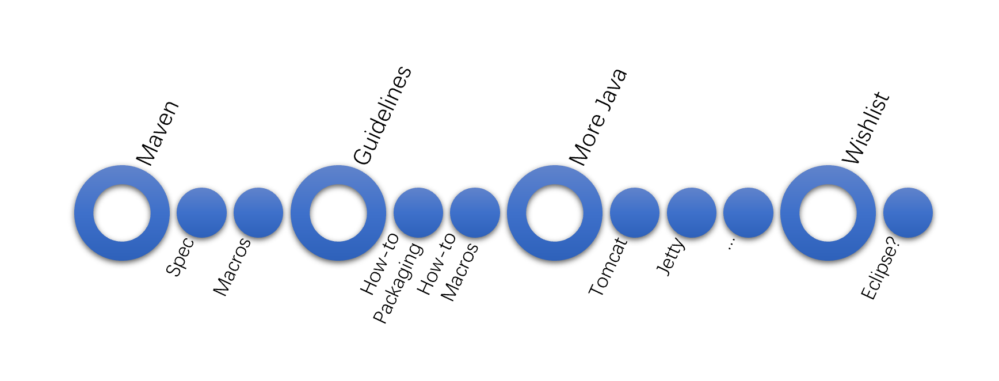

## 概述

openEuler Java SIG 致力于将 Java 生态中大量高质量开源应用、组件和基础库引入 openEuler 社区和系统，通过提供完善的构建解决方案、环境和指引文档，让更多对此感兴趣的人加入其中。

## 目标

- 首先在社区引入 maven,ant,gradle,sbt 这样的构建工具，为其他 Java 软件包的引入做好准备。当然这里主要是 maven。
- 定义编写 maven 构建相关的宏和脚本，屏蔽繁杂的实现细节，方便需要使用 maven 构建的 spec 的编写。
- 按需引入 Java 生态中的重要软件包，例如 tomcat、jetty、eclipse 等。
- 编写针对 Java 软件包的 spec 的指引文档，让更多人可以参与进来。
- 开发 javaporter 这样的自动化解析和打包工具，来减轻人力的投入。
- 创建一些针对不同 JDK 版本的 docker 镜像，这些镜像集成了完整的构建工具链（包括 maven 内部仓储）和环境，方便不同用途的构建和验证工作，例如开发者实验环境、CI 系统等。

## 任务

- 引入 maven：通过 rpm 的方式引入 maven 到社区。
- 定义 maven spec 宏：定义一系列用于简化针对 maven 构建的宏定义。
- Java 软件包打包自动化工具和指引文档。
- 引入更多重要 Java 生态中的应用、组件和基础库：例如 tomcat, jetty 等。
- 开放引入清单：鼓励更多人参与到 Java 生态引入的行列来。

## 组织会议

- 公开的会议时间：每周五 下午 6:00 - 6:30。
- 例会信息: 你可以在[这里][jp_issues]找到最新的例会信息。

## 成员

### Maintainer 列表

- wangchong1995924
- DingliZhang

### Committer 列表

- hht8 
- zhan-siyuan
- luozhao 

非常欢迎和感谢以上所有 issue 和 PR 的提交者。

## 联系方式

- 微信群：你可以在[这里][wechat_barcode]找到最新的二维码。
- 邮件列表: dev@openeuler.org。
- Slack workspace: openeulerworkspace.slack.com。
- Slack channel: #sig-java。
- Slack 邀请链接：https://join.slack.com/t/openeulerworkspace/shared_invite/zt-gwgkej74-O6O743~3LRM6LqPbnOPeww。

## 项目清单

### JavaPackages

**项目描述：**

该仓库用于存放 openEuler 社区 Java 打包相关代码、宏、工具，以及指引文档。此外，该仓库也是目前 Java SIG 日常开展工作的地方。欢迎感兴趣的来这里参与 [issue][jp_issues] 讨论和提交 [PR][jp_prs]。

**repository 地址：**

- https://gitee.com/openeuler/Java-Packages

[jp_issues]: https://gitee.com/openeuler/Java-Packages/issues?utf8=%E2%9C%93&state=all&issue_search=java-sig+%E5%B7%A5%E4%BD%9C%E4%BE%8B%E4%BC%9A
[jp_prs]: https://gitee.com/openeuler/Java-Packages/pulls
[wechat_barcode]: https://gitee.com/openeuler/Java-Packages/issues/I1SBKG

