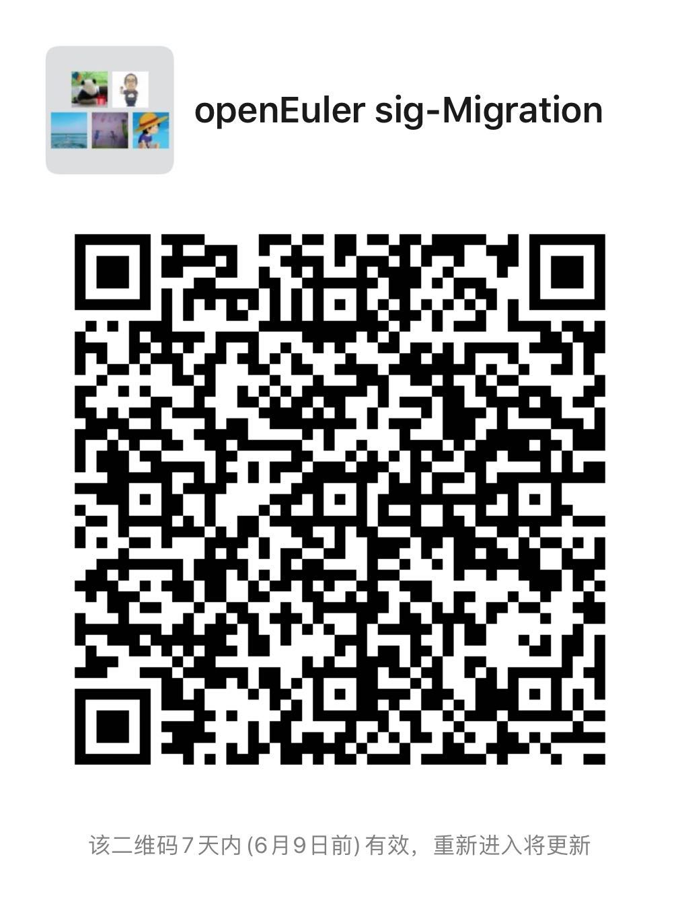

# Migration SIG

迁移sig组的目的是给社区提供迁移兼容性的辅助工具及解决方案，降低客户迁移国产操作系统和国产硬件的难度。

# 组织会议

- 公开的会议时间：NA
- 邮件讨论为主，涉及决策的内容，TC会议申报议题

# 成员

### Maintainers列表

- 叶青龙   <yeqinglong@uniontech.com> [[@yeqinglong01](https://gitee.com/yeqinglong01)]
- 马全一   <eli@patch.sh> [[@genedna](https://gitee.com/genedna)]
- 郭青岚   <guoqinglan@uniontech.com> [[@blublue](https://gitee.com/blublue)]
- weidongkl   <weidongkl@uniontech.com> [[@weidongkl](https://gitee.com/weidongkl)]
- 石  勇 <shiyong@kylinos.com.cn> [[@stonefly](https://gitee.com/stonefly)]

###  Committers列表

Everyone could send patches to openEuler.

#  联系方式

- 邮件列表 <dev@openeuler.org>

- [IRC频道](#openeuler-dev)

- [IRC公开会议](#openeuler-meeting)

- 微信群聊（二维码若过期，联系 weidong@uniontech.com 进群 ）

  

  

# 项目清单

- https://gitee.com/src-openeuler/migration-assistant
- https://gitee.com/openeuler/migration-assistant
