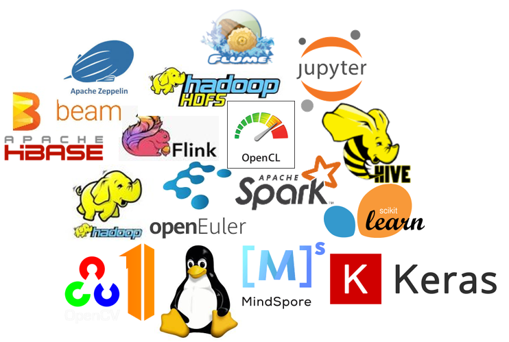
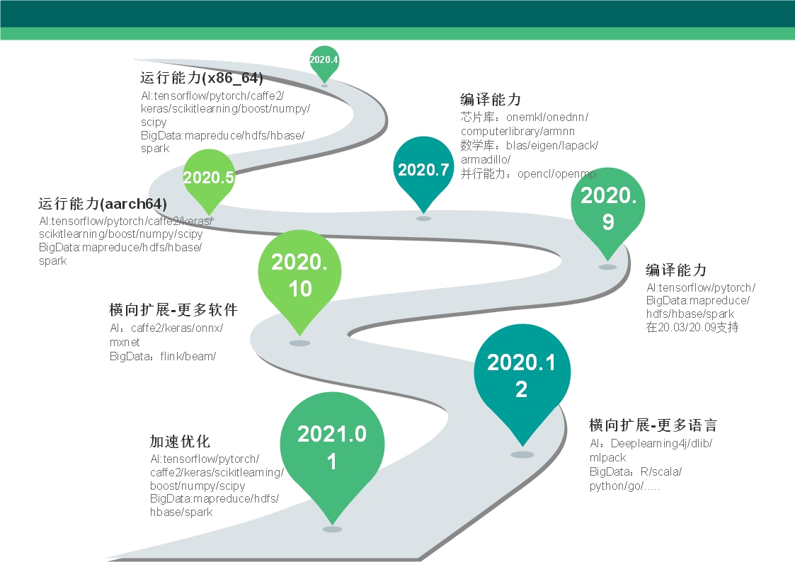

# Application to create a new SIG
English | [简体中文](./sig-ai-bigdata_cn.md)

Note: The Charter of this SIG follows the convention described in the openEuler charter [README] (/en/governance/README.md), and follows [SIG-governance] (/en/technical-committee/governance/SIG-governance.md).
 
 
 
# SIG Mission and Scope

- Why we create sig-ai-bigdata in openEuler
  - Big data and artificial intelligence have penetrated into many areas of our society, and used to improve productivity in many industries. 
  There are lots of enthusiasts outside the industrial and academic circles. 
  It is necessary to provide big data and artificial intelligence-related capabilities in open euler for scientists in research institutes and enthusiasts to implement big data and artificial intelligence on open euler, 

- Why we keep artificial intelligence and big data together
  - On the one hand, when big data is used in production on a large scale, artificial intelligence is still in the experimental stage, on the other hand, the popularization of artificial intelligence is gradually being imported from one application to another, leading to a split situation of the big data and artificial intelligence in many companies.
    In fact, the processing results of big data can then be used for model training, and the samples required for model training also require big data technology for preprocessing.
    After gradually realizing this, many big data tools have model training and inference functions, such as sparkml for spark, flinkml for flink, and many artificial intelligence frameworks are gradually enhancing their data processing capabilities, which has also spawned a few fusion tools such as big data and tony.
    Therefore, big data and artificial intelligence are directly considered together in open euler.

- The scope of the SIG
  - Basic capabilities of big data and artificial intelligence in open euler, including but not limited to supporting and accelerating libraries for various chips, various data warehouses, analysis engines, training engines, algorithm libraries, data sets, etc.
  - A unified platform for big data and artificial intelligence in open euler, integrating various commonly used tools and software to provide a unified user interface to make big data and artificial intelligence easier and better to use on open euler.
  - Performance optimization of big data and artificial intelligence in open euler.
  - Integration of big data and artificial intelligence capabilities in open euler, supporting new chips and softwares in open euler

- Which SIGs in openEuler to coorperate with
  - Some tool may have some dependency packages or libs, and in addition, they may have dependencies on kernel subsystems during new hardware support and performance optimization.
 
# Repositories and description managed by this SIG

- [jupyter](https://gitee.com/src-openeuler/jupyter): 
  An environment for interactive computing in multiple languages
- [tensorflow](https://gitee.com/src-openeuler/tensorflow): 
  A framework for deep learning
- [hadoop](https://gitee.com/src-openeuler/hadoop): 
  A software platform for processing vast amounts of data
- [libsvm](https://gitee.com/src-openeuler/libsvm): 
  A Library for Support Vector Machines
- [libhdfs](https://gitee.com/src-openeuler/libhdfs): 
  The Apache Hadoop Filesystem Library
- [ComputeLibrary](https://gitee.com/src-openeuler/ComputeLibrary): 
  ARM Compute Library
- [Shark](https://gitee.com/src-openeuler/Shark): 
  C++ machine learning library
- [arm-ml-examples](https://gitee.com/src-openeuler/arm-ml-examples): 
  Machine learning examples used in Arm's ML developer space
- [armnn](https://gitee.com/src-openeuler/armnn): 
  Arm NN SDK enables machine learning workloads on power-efficient devices
- [libmetal](https://gitee.com/src-openeuler/libmetal): 
  Bare metal interaction APIs
- [oneDNN](https://gitee.com/src-openeuler/oneDNN): 
  Intel(R) Math Kernel Library for Deep Neural Networks
- [pytorch](https://gitee.com/src-openeuler/pytorch): 
  python deep learning framework
- [SuperLUMT](https://gitee.com/src-openeuler/SuperLUMT): 
  Single precision real SuperLU routines for shared memory parallel machines
- [gl2ps](https://gitee.com/src-openeuler/gl2ps): 
  An OpenGL to PostScript printing library
- [glpk](https://gitee.com/src-openeuler/glpk): 
  GNU Linear Programming Kit
- [lzip](https://gitee.com/src-openeuler/lzip): 
  Lossless file compressor based on the LZMA algorithm
- [octave](https://gitee.com/src-openeuler/octave): 
  A high-level language for numerical computations
- [qrupdate](https://gitee.com/src-openeuler/qrupdate): 
  A Fortran library for fast updates of QR and Cholesky decompositions
- [sundials](https://gitee.com/src-openeuler/sundials): 
  Suite of nonlinear solvers
- [opencl-headers](https://gitee.com/src-openeuler/opencl-headers):  
  OpenCL (Open Computing Language) header files
- [eigen](https://gitee.com/src-openeuler/eigen): 
  a C++ template library for linear algebra: matrices, vectors, numerical solvers, and related algorithms.
- [opencl](https://gitee.com/src-openeuler/opencl): 
  OpenCL ICD Bindings
- [libxsmm](https://gitee.com/src-openeuler/libxsmm): 
  Library targeting Intel Architecture for specialized dense and sparse matrix operations, and deep learning primitives.
- [dlib](https://gitee.com/src-openeuler/dlib): 
  A modern C++ toolkit containing machine learning algorithms and tools for creating complex software in C++ to solve real world problems.
- [opennn](https://gitee.com/src-openeuler/opennn): 
  An open source neural networks library for machine learning.
- [mlpack](https://gitee.com/src-openeuler/mlpack): 
  A fast, flexible machine learning library, written in C++
- [ensmallen](https://gitee.com/src-openeuler/ensmallen): 
  A flexible C++ library for efficient numerical optimization
- [zookeeper](https://gitee.com/src-openeuler/zookeeper): 
  A high-performance service for building distributed applications
- [kafka](https://gitee.com/src-openeuler/kafka): 
  A Distributed Streaming Platform
- [incubator-mxnet](https://gitee.com/src-openeuler/incubator-mxnet): 
  Apache MXNet (incubating) is a deep learning framework designed for both efficiency and flexibility.
- [opencv](https://gitee.com/src-openeuler/opencv): 
  OpenCV means Intel® Open Source Computer Vision Library.
- [ibis](https://gitee.com/src-openeuler/ibis): 
  A toolbox to bridge the gap between local Python environments, remote storage, execution systems like Hadoop components (HDFS, Impala, Hive, Spark) and SQL databases. Its goal is to simplify analytical workflows and make you more productive.
- [presto](https://gitee.com/src-openeuler/presto): 
  A distributed SQL query engine for big data.
- [rain](https://gitee.com/src-openeuler/rain): 
  An open-source distributed computational framework for processing of large-scale task-based pipelines.

# Basic Information

## Project Introduction
    [detail](https://gitee.com/openeuler/community/sig/sig-ai-bigdata/)

## Maintainers
  - [sinever](https://gitee.com/sinever)
  - [hubble_zhu](https://gitee.com/hubble_zhu)
  - [myeuler](https://gitee.com/myeuler)

## Committers
  - [sinever](https://gitee.com/sinever)

## Mailing list
  - sig-ai-bigdata@openeuler.org  
  [subscribe](https://openeuler.org/zh/community/mailing-list/)  
  [archive](https://mailweb.openeuler.org/hyperkitty/list/sig-ai-bigdata@openeuler.org/)  
  
 ## 路线图
 