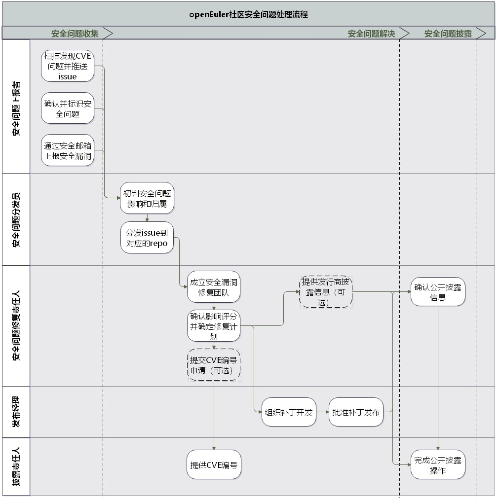

# 安全问题处理和发布流程

openEuler已经采用本文中描述的安全披露和响应策略，以确保我们及时负责的处理安全问题。

目录

+ [产品安全委员会](#安全委员会)
+ [使命和工作职责](#使命和工作职责)
	+ [成员管理方式](#成员管理方式)
  + [成员的角色说明](#成员的角色说明)
+ [安全问题处理和披露流程](#安全问题处理和披露流程)
     + [安全问题收集](#安全问题收集)
     + [安全问题确认](#安全问题确认)
     + [成立修复团队](#成立修复团队)
      + [制定修复计划](#制定修复计划)
             + [安全问题影响性评估](#安全问题影响性评估)
        + [安全问题响应说明](#安全问题响应说明)
     + [组织补丁开发](#组织补丁开发)
     + [修复披露](#修复披露)
  + [修复流程回顾](#修复流程回顾)
  
+ [安全问题处理和披露流程示意图](#安全问题处理和披露流程示意图)
  
+ [发行商名单](#发行商名单)

## 安全委员会（SC）

安全委员会（SC）负责整个社区对安全问题的响应，包括内部沟通和外部披露，但整个过程需要在相关开发人员和发布经理的协助下完成。SC将由订阅了[openEuler安全邮件列表（私有）](security@openeuler.org)的志愿者组成。

### 使命和工作职责

SC的工作职责请参考[README](README.md)

### 成员管理方式

- 成员应保持积极主动的态度

- 延长休假1个月或更长时间的成员应与其他成员进行协调，以确保在休假期间为该角色配备足够的人员

- 休假1~3个月的成员可以确定一个临时的替补

- 角色成员可以罢免其他未请假，但无法联系超过1个月或者未履行其书面职责超过1个月的成员。这个罢免也通过“[多数共识](https://en.wikipeedia.org/wiki/Supermajority#Two-third_vote)“完成

  

#### 加入

- SC一般由7个成员组成

- 新成员通常从技术指导委员会、发行经理或补丁发行经理、以及SIG内负责安全工作的核心成员中提名。

- 提名的新成员通过“[懒惰的共识](https://openoffice.apache.org/docs/governance/lazyConsensus.html)”完成投票

- 为了让新加入的成员熟悉安全委员会的工作职责和流程，新加入SC成员将首先担任至少三个月的准成员

#### 退出

成员随时可以退出，并从合格的准成员中提议替代成员。如成员退出需要投票，将按照[“多数共识”](https://en.wikipeedia.org/wiki/Supermajority#Two-third_vote)完成

### 成员角色说明

由于安全处理流程涉及到多个环节和对应的职责，SC的成员会被赋予一些特定的角色，以更加明确的承担这些环节的职责。以下是各个角色的定义，这些角色会定期进行轮换，以保证每一个人都有机会了解openEuler的安全处理机制

**修复责任人**

跟踪协调每一个安全问题的从“生”到“死”

**问题分发员**

- 确保应该处理问题的人员都已经收到通知

- 响应还未被确认为安全问题的问题

- 协助确认安全问题在openEuler产品的评分

- 如果开发者在处理安全问题的时候有分歧，也可以视需要上升到问题分发员。

  在线的SC成员都会负责该工作，他们会按照上报的顺序响应安全请求的原则。

**基础设施保障员**

这个角色确保漏洞扫描、代码安全合规扫描等配套的安全工具正常工作，包括：

- 确认工具的正常运行
- 分发和处理工具扫描的结果。包括确保漏洞扫描发现的问题的正确分发，完成新软件包的合规扫描入库等
- 分析和提出安全领域工具的优化需求

**披露员**

- 按照规则收集披露问题；
- 向安全委员会提交披露申请，包括安全公告和安全问题；
- 提供符合披露原则的披露相关公共消息发布。包括相关的披露信息、升级文档、日志变更、向公众解释严重性，将错误通知发送到邮件列表，请求CVE等。

**安全联络员**

该角色不是SC的成员，每一个SIG团队内都应该指定参与安全活动的SIG成员，这个角色应该由希望后继加入SC的成员承担。他们将负责：

+ 优先处理分发给本SIG团队内的安全问题
+ 提供本SIG内项目的安全问题披露内容
+ 协助开展安全流程改进，激励管理、审核代码或其他不公开的安全活动

**发布团队**

安全补丁发布团队属于[发布团队](sig-release)的一部分，他们在安全流程里会负责：

- 刷新[发行商列表](private-distributors-list.md)——管理发行商列表

+ 组织和发布补丁——在必须提供安全修复程序时，组织涉及到的SIG内的Maintainer，管理构建和发布补丁

**发布经理**有责任在整个生命周期内组织相关活动的开展，遵守安全问题处理和披露的流程要求。

## 安全问题处理和披露流程

### 1、安全问题收集

####  CVE例行扫描

- openEuler社区会采用XXX漏洞扫描工具，对社区上使用的上游社区软件包公开披露的漏洞进行例行扫描和同步。
- 扫描出的漏洞会按照[安全问题模板](template-security-bug.md)的格式向对应的SIG推送带有“CVE”标签的Issue

#### 内部上报

SIG内的bug被团队成员确认为安全漏洞，团队成员将对应的Issue调整成“私有”，同时添加“安全问题”标签，并根据实际情况添加“优先级”标签。安全问题分发员会定期查看此类问题的更新情况。

####  外部上报

如果您知道一个安全漏洞，不在openEuler安全团队已经处理的公开安全漏洞的列表之内，烦请立即发送电子邮件至security@openeuler.org通知SC，以便于他们可以启动补丁、发布和公告过程。

请采用[安全流程电子邮件模板](email-templates.md)，同时您可以使用[openEuler安全委员会](README.md)成员的GPG秘钥将电子邮件加密到此邮件。收到上报邮件后，安全问题分发员会在其repository内新建一个安全Issue。

如果有需要，SC将询问您是否可以通过负责人的方式秘密披露此问题。如果您反对，我们将采用公开披露的方式。

### 2、安全问题确认

安全问题分发员会完成对新问题的确认，包括：

- 对于外部上报的安全问题，确定受影响的项目和软件包。
- （包括外部上报问题和CVE问题）联系相关工程师（会优先从项目的Maintainer和Committer中选择），推动尽快确认是否是新的安全问题。确认后将Issue（私有）分发到对应的repo
- 对于外部上报的安全问题，确认后通知问题上报人。

确认结果记录在Issue的进展内，并调整Issue的状态进入解决阶段。

### 3、成立修复团队

修复负责人将组织修复团队，修复团队包括：

- 对应的版本或补丁发布经理

- 受影响项目的SIG成员，优先选择前期已经参与问题分发阶段的团队成员（定义在其对应的*OWNERS*文件内）

### 4、制定修复计划

对于每一个漏洞，修复责任人会与修复团队，发布经理进行协调，并负责向社区相关成员发送电子邮件。修复责任人会根据问题的严重性，开发需要的时间和发布经理反馈的版本计划，综合自己最佳的判断来制定问题的修复计划。

#### 安全问题影响性评估

修复负责人和修复团队将使用[CVSS计算器](https://www.first.org/cvss/specification-document#i5)创建一个CVSS。他们会将使用“[严重性评估——我们如何进行漏洞评分]()”来确定错误的影响和严重性。修复负责人对计算出的风险进行最终评估。

- 如果评估分数低于4.0（严重性分数较低）或评估的风险较低，则修复责任人可以选择半公开进行修复。这意味着PR是直接在公开的openEuler存储库上进行的，同时可以在公开渠道讨论。同时修复团队可以在特定情况下（比如假期等）放慢发布过程。这些决策必须在安全会议上讨论。

- 如果评估分数低于6（严重程度中等），高于4.0，则修复责任人也可以选择半公开进行修复。修复责任人将确定公开处理该修复程序是否会对用户造成伤害，以决定是否将对问题安全性方面的讨论限定在私有渠道。

注意：修复责任人有权对漏洞的严重程度进行分类。

#### 安全问题响应说明

- 如果处理的是openEuler社区开发项目的安全问题，则所有的计划时间表会尽快形成。
- 如果不是，则修复程序依赖于上游社区的披露时间表。修复责任人会通过与上游社区的合作，尽量做到在适应上游社区时间表的同时，最大程度的保护openEuler社区的用户。

### 5、组织补丁开发

+ 如需要在私有安全库进行开发，修复负责人将使修复团队可以访问openEulerXXXXXX中的私有安全存储库，以开发修复程序。
+ 修复负责人将向[openEuler CVE编号颁发机构申请CVE](cve-request.md)，**上游社区公开披露的CVE不需要此过程**。
+ 发布经理发布经理根据发布计划组织补丁开发
+ 私有ropo上相关修复文件已经提交到对应版本的软件包库，或者公开修复的软件包已经提交到对应的软件包库。发布经理将通知修复责任人——修复工作已经完成。

注意：openEuler私有安全存储库由SC拥有。组织管理由sig-infrastructure完成。

### 6、修复披露

随着修复的开展，修复负责人需要针对更广泛的社区范围提交总体沟通计划。总体沟通启动应该在修复团队制定了修复或缓解措施以后开始，以便可以将可达成的计划传递给用户。

**发行商披露（可选）** （在问题确认后1~14天内完成）

+ 如果问题严重到需要尽早通知发行商，修复负责人将在修复团队的帮助下做出此决定。比如影响严重的“可远程利用”或“特权升级”等问题。否则可以跳过此过程。
+ 修复负责人将补丁程序通过电子邮件发送给distributors-announce@openEuler.org，以便发行商可以提前准备，并在发行版发布之日向用户提供版本。发行商应订阅[发行商披露邮件列表](distributors-announce@openEuler.org)，阅读[发行商披露须知](private-distributors-list.md)信息，以了解添加到该列表的要求。

**修复发布日**（在问题确认后1~21天内完成）

+ 在即将发布前，至少提前24小时通过电子邮件通知[发行商](private-distributors-list.md)，通知信息应包含公共消息，公告的日期。
+ 修复负责人会将补丁推送到master分支和相关的发行版本分支。修复团队会使用/lgtm和/approve通过
+ 版本的发行经理会尽快merge这些PR。此时不应更改提交内容，以防止与发送给发行商的补丁程序产生不应有的冲突，以及在分支选择patch时发生冲突。
+ 发行经理应确保所有的二进制文件通过build，可公开使用且正常运行。
+ 修复负责人将提供新版本号、CVE编号（如有需要）、严重性和影响以及二进制文件的位置的信息给披露负责人，以支撑更广泛的分发和用户操作。此披露负责人将尽早将公告更新到社区页面，并应包括用户在升级到固定版本之前可以采用的任何缓解措施。公告将通过以下渠道发送
  + security@openeuler.org
  + distributors-announce@openeuler.org
  + [社区安全页面](https://openeuler.org/zh/security.html)
  +  在https://gitee.com/openeuler/issues 中打开问题，并标记成`area/security`，并以相关CVE ID为前缀
  
+ 如涉及，修复负责人将从私人安全存储库中删除修复团队

### 7、修复流程回顾

这些步骤应该在发布日期后的1~3天完成。回顾过程是改进的动力。

+ 修复负责人将该问题的回顾过程发送到security-discuss-private@openeuler.org，包括有关每个人的详细信息，过程时间表的执行情况，与引入该问题相关的PR链接，以及对响应和发布的任何处理或建议。
+ 鼓励发行经理和修复团队将自己的反馈意见发送到security-discuss-private@openeuler.org。诚实的批判是我们改善社区的唯一途径。

## 安全问题处理和披露流程图示

## 发行商名单

该列表用于向openEuler的发行商提供安全相关可操作的信息，请参考[发行商列表](private-distributors-list.md)

